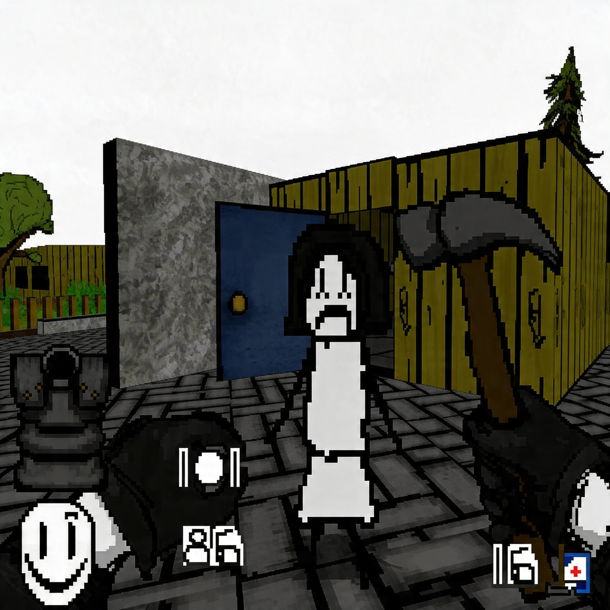
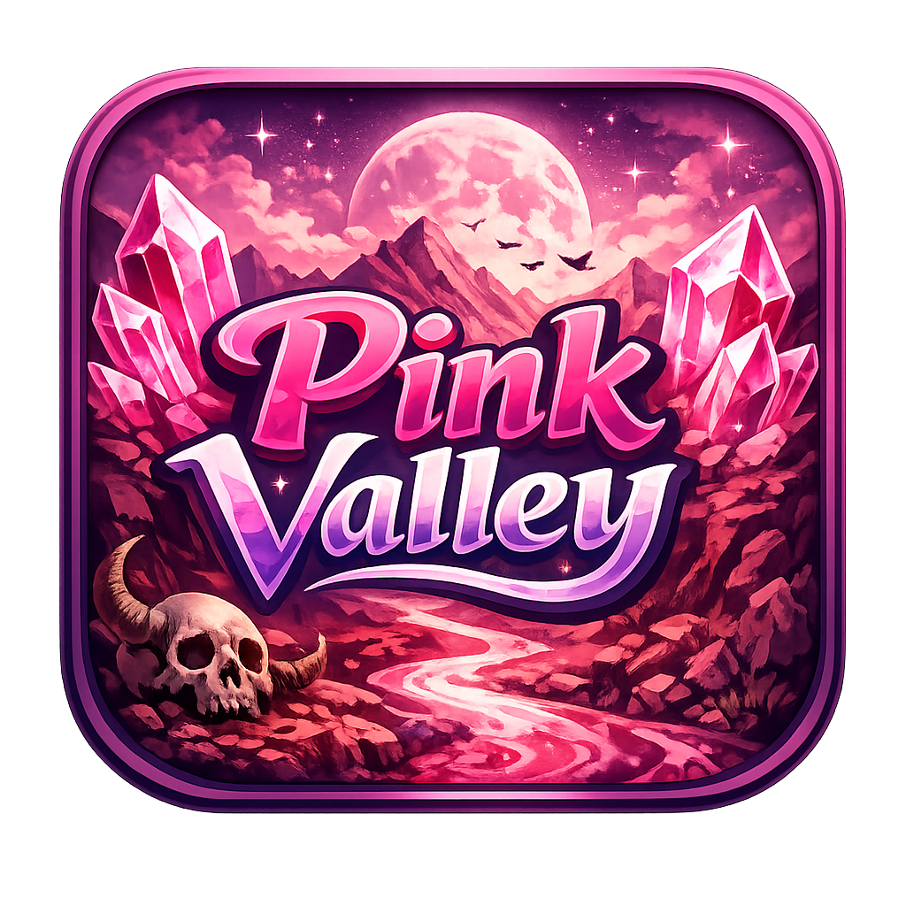
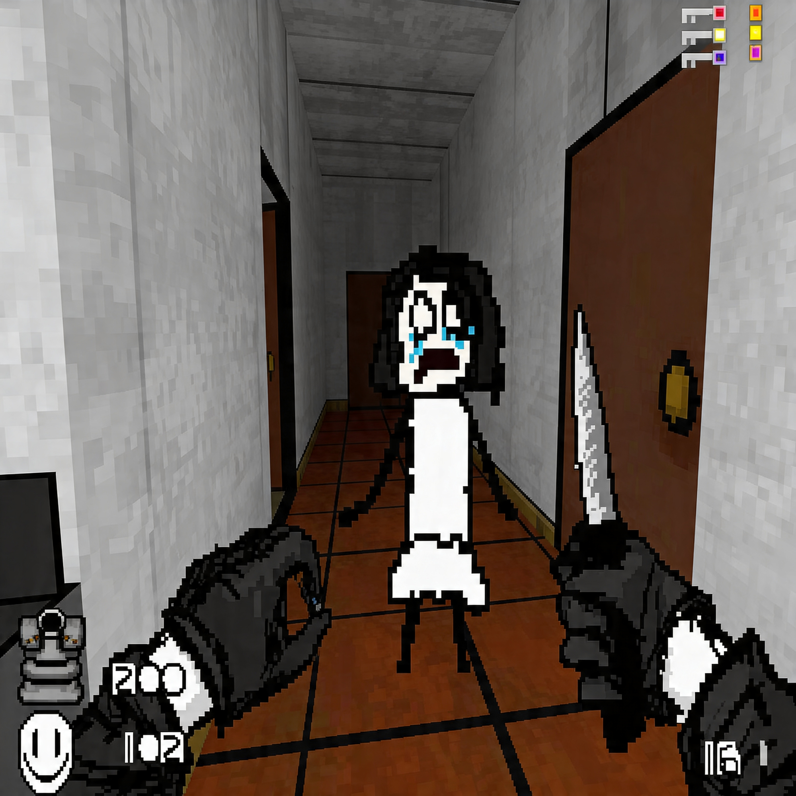

# THE PINK VALLEY

**THE PINK VALLEY** is a surreal horror first-person shooter mod for Doom II, designed for modern Doom source ports such as GZDoom and LZDoom. Created by **vamvilodon**, it mixes classic Doom-style combat with abstract storytelling, exploration-heavy levels, custom enemies, handmade weapons, original music, and a strange visual identity built around fog, shadows, harsh contrasts, and pink nightmare spaces.

This is not a normal run-and-gun Doom map pack. THE PINK VALLEY is a personal, experimental campaign where familiar FPS rules slowly become uncomfortable: empty streets turn into hostile mazes, cartoon-like sprites collide with oppressive environments, and intense action is interrupted by long, disorienting moments of atmosphere.

Version 1.1 includes the English release, with translated map names, skill levels, obituaries, and selected textures. It also enables automap support, redesigns some levels to make progression more intuitive, and keeps the original focus on exploration, tension, and surreal horror.

## Screenshots

<table>
  <tr>
    <td width="50%"></td>
  </tr>
  <tr>
    <td width="50%"></td>
    <td width="50%"></td>
  </tr>
</table>

## Features

- Full horror-action campaign for Doom II / Freedoom.
- Custom maps, enemies, weapons, items, sprites, music, and decorative assets.
- Strong focus on exploration, strange spaces, fog, shadows, and atmosphere.
- Surreal storytelling with disturbing, experimental horror elements.
- English version available with translated names, skills, obituaries, and some textures.

## Download

- [Play and download on itch.io](https://vanvilodon.itch.io/the-pink-valley)
- [English version on ModDB](https://www.moddb.com/mods/the-pink-valley/downloads/the-pink-valley-11-english-version)
- [English version on IndieDB / FreeDOOM](https://www.indiedb.com/games/freedoom/downloads/the-pink-valley-11-english-version)
- [Game Jolt page](https://gamejolt.com/games/pink-valley/1076532)

## How To Play

1. Download the latest package.
2. Extract the archive.
3. Launch the included executable, or run the mod through GZDoom with Doom II or Freedoom2.
4. Check your video settings before playing, because fog, shadows, and lighting are important to the atmosphere.

GZDoom is recommended for the best presentation. LZDoom may work, but some visual details can be missing.

## Recommended Settings

- Enable fog.
- Use a sector light mode that preserves shadows.
- Avoid textured automap if you want to keep the intended atmosphere.
- If the HUD is missing, try setting the screen size to 11 in GZDoom.
- Use low volume if you are sensitive to loud or chaotic sound.

## Content Warning

THE PINK VALLEY contains horror themes, intense violence, flashing lights, harsh colors, loud audio, and emotionally heavy material. It may not be suitable for players sensitive to flashing effects, sound overload, gore, or depressive themes.

## Community

- [THE PINK VALLEY on DoomWiki](https://doomwiki.org/wiki/THE_PINK_VALLEY)
- [THE PINK VALLEY on ModDB](https://www.moddb.com/mods/the-pink-valley)
- [The Pink Valley Wiki](https://thepinkvalley.miraheze.org/wiki/The_Pink_Valley_Wiki)
